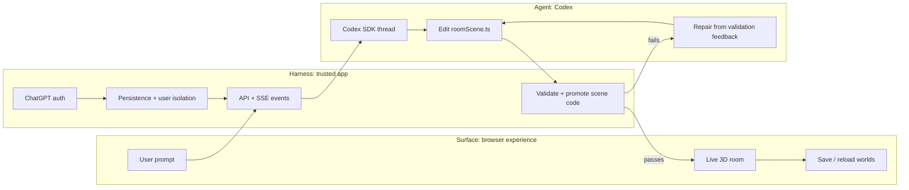

# System Walkthrough

This walkthrough summarizes the shape of Roomscape for contributors, reviewers, and technical demos. It focuses on the system boundary between the trusted app and the generated room sandbox.

## Core Idea

Roomscape embeds Codex as a runtime creative engine. The user sees a simple 3D surface, the trusted app harness keeps control of product responsibilities, and the agent edits only constrained scene code.

## Key Flow

1. A user prompts the Architect from the browser workspace.
2. The trusted server starts or resumes a Codex SDK thread for the active room.
3. Codex edits only the generated scene module inside the active room workspace.
4. The app validates the generated scene contract and sandbox policy.
5. Passing scene code is promoted into the active room and streamed back to the browser.
6. Auth, persistence, telemetry, approvals, and isolation remain in the trusted app.

## Code Pointers

[`src/server/agent/codexArchitectRunner.ts`](../src/server/agent/codexArchitectRunner.ts)

Codex runtime setup. `startThread(...)` uses Codex programmatically, while `workingDirectory`, `approvalPolicy`, and `networkAccessEnabled` keep the agent inside the generated-room boundary.

[`src/server/agent/roomCodeRepository.ts`](../src/server/agent/roomCodeRepository.ts)

Validation and promotion. `validateSceneSource(...)` rejects unsafe or broken generated code, and `writeActiveSceneSource(...)` promotes code only after validation passes.

[`sandbox/rooms/active/roomScene.ts`](../sandbox/rooms/active/roomScene.ts)

Generated scene contract example. The sandboxed scene exposes `roomTitle` and `buildRoom(...)` while leaving cameras, renderers, networking, persistence, and DOM ownership to the trusted host.

## Summary

Codex is embedded inside Roomscape as a bounded runtime agent: natural language becomes generated Three.js scene code, and the trusted host validates that code before it becomes a live room.
