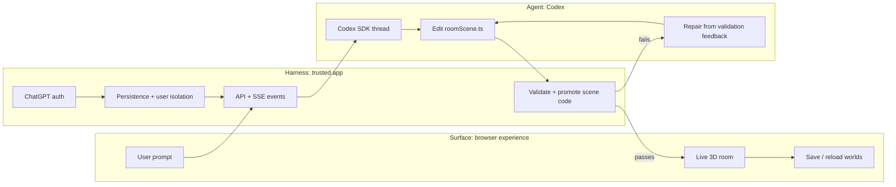

# Demo Walkthrough

Use this for a short, high-level hackathon walkthrough. The goal is to show the shape of the system, not every implementation detail.

## The Core Idea

Roomscape embeds Codex as a runtime creative engine. The user sees a simple 3D surface, the trusted app harness keeps control of product responsibilities, and the agent edits only constrained scene code.

## What To Show In 2.5 Minutes

1. Start with the diagram above.
   Say: "Roomscape has a surface, a harness, and an agent. The surface is the 3D experience. The harness is the trusted product layer. The agent is Codex, constrained to scene code."

2. Show the Codex runtime setup:
   [`src/server/agent/codexArchitectRunner.ts`](../src/server/agent/codexArchitectRunner.ts)

   Best lines to highlight:
   - `startThread(...)` shows Codex being used programmatically.
   - `workingDirectory`, `approvalPolicy`, and `networkAccessEnabled` show the harness constraining the agent.

3. Show validation and promotion:
   [`src/server/agent/roomCodeRepository.ts`](../src/server/agent/roomCodeRepository.ts)

   Best lines to highlight:
   - `validateSceneSource(...)` shows the harness refusing unsafe or broken generated code.
   - `writeActiveSceneSource(...)` shows that code is promoted only after validation.

4. Show the generated scene contract:
   [`sandbox/rooms/active/roomScene.ts`](../sandbox/rooms/active/roomScene.ts)

   Best lines to highlight:
   - `roomTitle`
   - `buildRoom(...)`

## One-Sentence Close

Codex is not just helping build the app; it is embedded inside the product as a bounded agent that turns natural language into validated, live 3D experiences.
